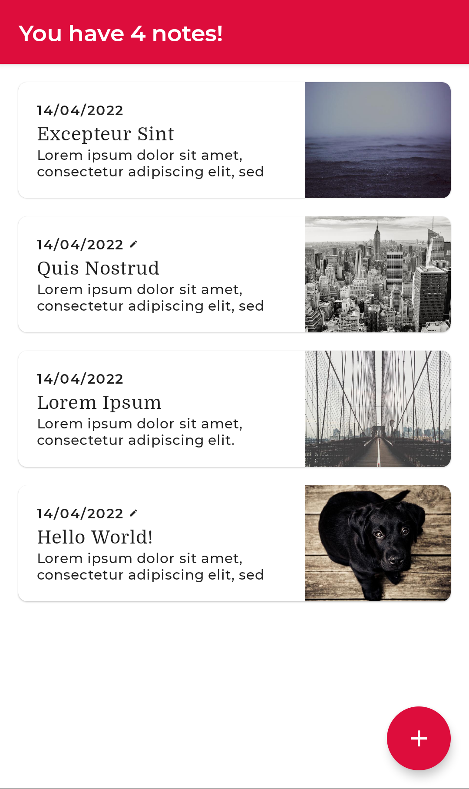
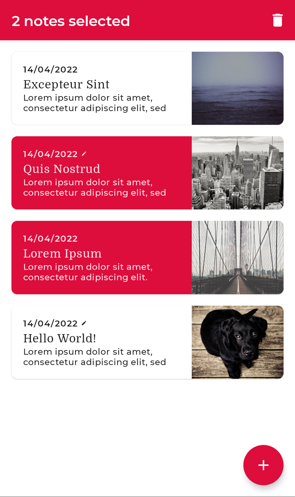

<h1> NoteApp</h1>

 
 

A note taking app illustrating Android best practices with Jetpack Compose.

## Screenshots

  

## Tech stack

* Written in [Kotlin](https://kotlinlang.org/)
* Built entirely using [Jetpack Compose](https://developer.android.com/jetpack/compose)
* Dependency injection done by [Dagger Hilt](https://dagger.dev/hilt/)
* [Room](https://developer.android.com/training/data-storage/room) for persistence
* [Coroutines](https://kotlinlang.org/docs/coroutines-overview.html) with [Flow](https://kotlin.github.io/kotlinx.coroutines/kotlinx-coroutines-core/kotlinx.coroutines.flow/-flow/) for asynchronous operations
* Tests with [JUnit](https://developer.android.com/training/testing/local-tests)

## License

    Copyright 2022 Omer Karaca

    Licensed under the Apache License, Version 2.0 (the "License");
    you may not use this file except in compliance with the License.
    You may obtain a copy of the License at

       https://www.apache.org/licenses/LICENSE-2.0

    Unless required by applicable law or agreed to in writing, software
    distributed under the License is distributed on an "AS IS" BASIS,
    WITHOUT WARRANTIES OR CONDITIONS OF ANY KIND, either express or implied.
    See the License for the specific language governing permissions and
    limitations under the License.
